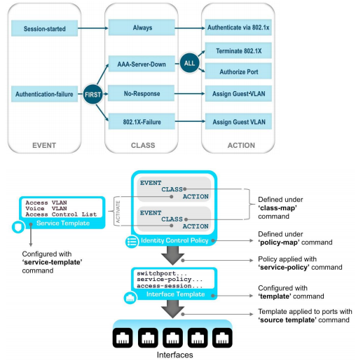
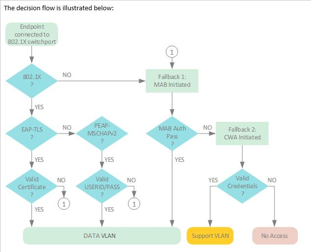

# pyBNS2

A pyATS conversion utility to transform your access layer into IBNS 2.0 using C3PL 

Written by Justin Thériault & John Capobianco Sept. 2021

## What is IBNS 2.0?
IBNS 2.0 Official Page
<https://www.cisco.com/c/en/us/products/ios-nx-os-software/identity-based-networking-services/index.html>

IBNS 2.0 At A Glance
<https://www.cisco.com/c/dam/en/us/products/collateral/ios-nx-os-software/identity-based-networking-services/aag_c45-731544.pdf>

## What is C3PL?




## Getting Started
PyATS Installation
<https://pubhub.devnetcloud.com/media/pyats/docs/getting_started/index.html>

```python
pip install pyats[full]

git clone https://github.com/automateyournetwork/pyBNS2.git

#update your testbed file to match your target device

pyats run job C3PL_job.py --testbed-file ../testbeds/testbed_sample.yml
```
## Artifacts

Part of the PyBNS2 conversion utility includes a pre-state and a post-state capture as well as a differential of pre/post. Refer to the following folders to see the outputs of each stage per device:

* backup_configs
This folder contains the plain-text running config of the target device

* pre_configs
This folder contains the JSON output of the following show commands, taken before the device is converted
    * show mac address-table
    * show authentication sessions
    * show interface status
    *show dot1x all details

* post_configs
This folder contains the JSON output of the show commands listed above, taken after the device is converted

* changelog
This folder contains the differential outputs of the files in pre_configs and post_configs

## Suggested Customization
* Your testbed file
* Your current "legacy-mode" interface commands to remove, in /templates/legacy_dot1x_removal.j2
* New C3PL interface timers and commands to be added, in /templates/C3PL_new_int_config_enforcement.j2 and /templates/C3PL_new_int_config_monitor.j2
* global service templates, class-maps and policy-maps, to be added, in /templates/C3PL_new_global_configs.j2

## Tested platforms
We've done our best to test this job against the following Cisco platforms
* Catalyst 9300
* Catalyst 3850
* Catalyst 3560

# Disclaimer
The authors of this code do not accept any responsibility for unforseen impact. We recommend that this be tested in a lab environment and customised for your production environment before being run on live devices.

Network access control settings are being changed when running this job. Please use this code responsibly.